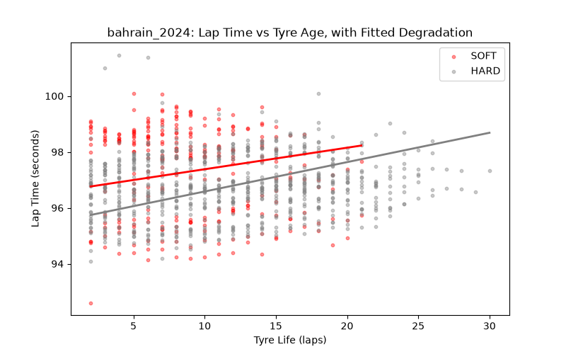
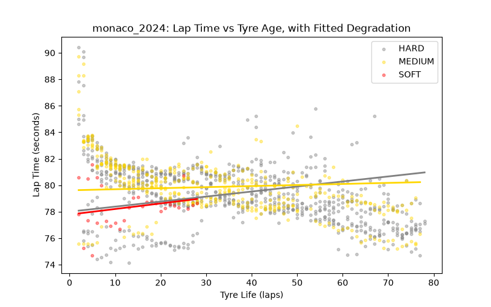
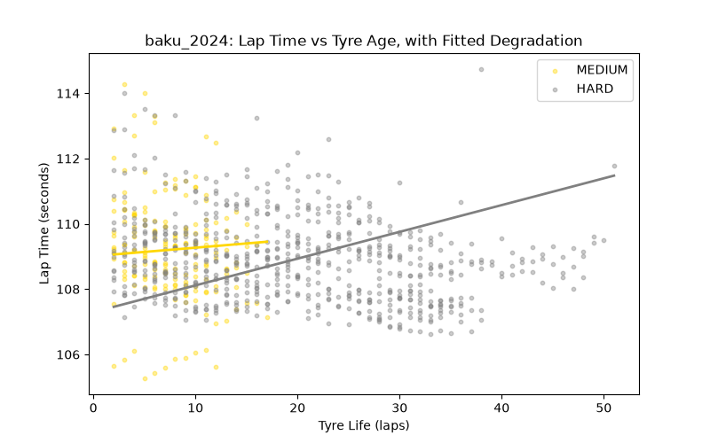
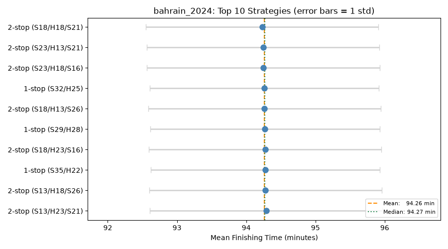
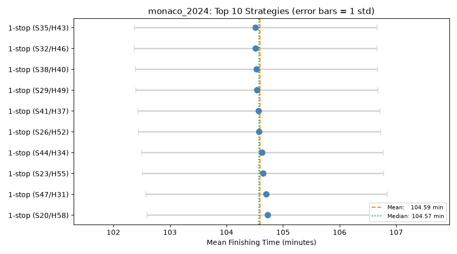
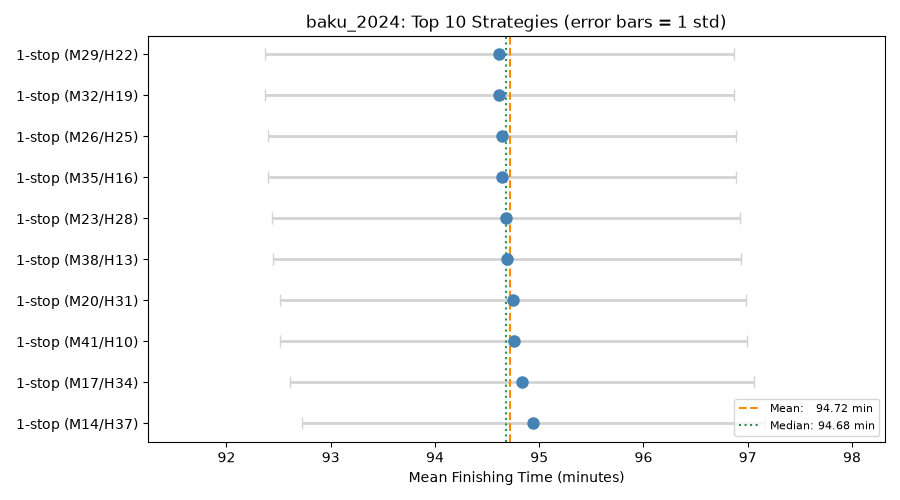
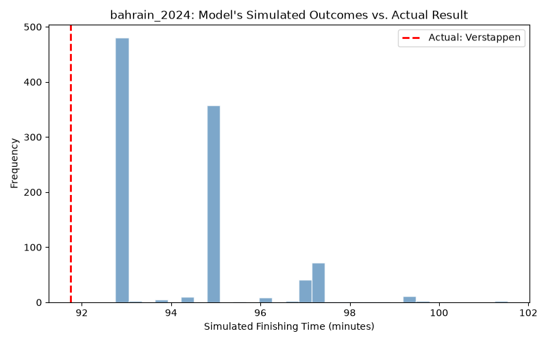
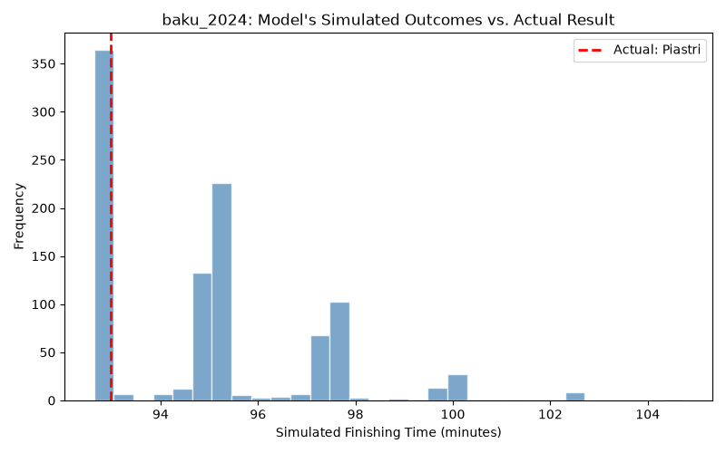

# F1 Strategy Optimizer

A project to model tire degradation and simulate race strategy for Formula 1, using real race data pulled via the FastF1 API. The goal is to predict how different pit stop strategies would perform under given track and safety car conditions, then validate the model's recommendations against what actually happened in real races.


## Motivation

Race strategy in F1 is a set of decisions made under uncertainty: teams choose pit stop timing and tire compounds based on degradation models, safety car probability, and track position, often with incomplete information in real time. This project builds a simplified version of that decision process, from raw timing data through to a Monte Carlo simulation of strategy outcomes.


## Project status
 
This is a complete, working project. All planned features are implemented and validated.
 
- [x] Environment setup (FastF1, pandas, numpy, matplotlib)
- [x] Pull raw lap data for a first race (Bahrain 2024)
- [x] Clean lap data (remove pit laps, safety car laps, outliers)
- [x] Fit tire degradation model per compound (tire wear separated from fuel effect)
- [x] Build lap-by-lap race simulation engine
- [x] Add safety car probability and Monte Carlo simulation
- [x] Run strategy optimization across a grid of strategies for one race (Bahrain)
- [x] Validate model output against real Bahrain 2024 race results
- [x] Extend strategy optimization across multiple races
- [x] Add a visualization section (degradation plots per race, strategy comparison charts)
- [x] Interactive dashboard (Streamlit)


## Data source

Race data is pulled using [FastF1](https://github.com/theOehrly/Fast-F1), a Python library that provides access to official F1 timing and telemetry data. Data includes lap times, tire compound and age, pit stop timing, and track status per lap.


## Validation

### Bahrain 2024

Max Verstappen's race-winning strategy at the 2024 Bahrain GP was a 2-stop, soft-hard-soft, with stints of 17, 20, and 20 laps (actual race time: 91.75 minutes).
 
Simulating this exact strategy through the model and comparing it against the full grid of 42 tested strategies:
 
- **Ranking:** the real strategy placed 2nd out of 42, within a fraction of a minute of the model's own top pick. The model independently identified the actual race-winning strategy as near-optimal, without being told the outcome in advance.
- **Absolute time:** the model predicted a mean finishing time of 94.24 minutes, about 2.5 minutes slower than the actual 91.75 minutes. This gap is expected: the degradation model is fit on all drivers' laps pooled together, not Verstappen's specifically, and the Monte Carlo safety car simulation reflects an average across 1,000 simulated races rather than the specific (lighter) safety car conditions of the real one.

Overall, the model's relative judgment matches reality closely, while its absolute time prediction carries a known, explainable offset rather than being arbitrarily off.


### Baku 2024

Oscar Piastri's race-winning strategy was a 1-stop, medium-hard, with stints of 15 and 36 laps (actual race time: 92.97 minutes). Simulating this against the Baku strategy grid:
 
- **Ranking:** the real strategy placed 10th, behind several strategies favoring a longer medium stint (the model's top pick used a 29-lap medium stint versus Piastri's 15). This gap is explainable: Piastri's own post-race comments describe pushing hard and overheating his tires early in traffic to build a lead, prompting an earlier stop than pure tire-age degradation would suggest, a driving and race-context factor the model has no way to represent, since it only knows tire age, not how hard a specific driver pushed or whether they were in another car's dirty air.
- **Absolute time:** the model predicted a mean finishing time of 94.91 minutes, about 1.9 minutes slower than the actual 92.97 minutes, a similar-sized gap to Bahrain's, for the same underlying reasons.


### Monaco 2024

**Monaco 2024 was excluded from validation.** The race was red-flagged on lap 1 after a multi-car crash, and tire changes during that stoppage were free (no pit lane time loss), unlike every pit stop this model simulates. Comparing the model's prediction against this specific race would not be a meaningful test, since the real result was shaped by an event the model has no way to represent, not by strategy quality.
 
Overall, the model's relative judgment (which strategy is best) matches reality closely at Bahrain and reasonably well at Baku, with the Baku gap traceable to a specific, identifiable driver behavior rather than an unexplained miss. Its absolute time predictions carry a consistent, explainable offset (driven by field-average pace and average simulated safety car conditions) rather than being arbitrarily off.


## Visualizations

### Tire degradation fits

Showing raw lap times with the fitted degradation model overlaid, per compound and race:





### Strategy comparison

Top 10 strategies per race by mean finishing time, with standard deviation shown as error bars and the mean/median of the top 10 marked:





### Validation

The model's simulated distribution of outcomes for the real winning strategy, with the actual race result marked:





## Dashboard
 
An interactive Streamlit dashboard lets you pick a race, build a custom 1-stop or 2-stop strategy, and see simulated results compared against the model's top strategies for that race.
 
```bash
streamlit run dashboard.py
```


## Project structure

```
f1-strategy-optimizer/
  data/                        raw and cleaned lap data (CSV)
  cache/                       FastF1 local cache (not tracked in Git)
  test_setup.py                environment check script
  pull_race.py                 pulls and saves raw race data
  inspect_data.py              inspects raw data and produces the cleaned lap dataset
  degradation_model.py         fits the tire degradation model (tire wear + fuel effect) and plots it
  simulate_race.py             deterministic lap-by-lap race simulator
  optimize_strategy.py         Monte Carlo simulation with safety car randomness, strategy grid search
  validate_model.py            validates model output against real Bahrain and Baku 2024 results
  visualize.py                 generates degradation, strategy comparison, and validation plots
  dashboard.py                 interactive Streamlit dashboard
  degradation_scatter.png      lap time vs tyre age plot, output of degradation_model.py
  degradation_fit_*.png        degradation model fit per race, output of visualize.py
  strategy_comparison_*.png    top 10 strategies per race, output of visualize.py
  validation_*.png             simulated outcome distribution vs actual result, output of visualize.py
  requirements.txt
  README.md
```


## Limitations
 
**Resolved:** the tire degradation model originally fit lap time against tire age alone, which conflated tire wear with fuel burn-off (cars get lighter and faster as fuel depletes over a race). This showed up as a negative degradation slope for soft tires, implying tires got faster with age, which isn't physically real. This has been fixed by fitting lap time against both tire age and lap number (as a proxy for fuel load) using multiple linear regression, which separates the two effects. Both compounds now show a positive tire wear slope, as expected.
 
**Resolved:** Baku 2024's fitted MEDIUM tire wear slope initially came out negative. Investigation traced this to several drivers starting the race on medium tires, so their `TyreLife == 1` lap coincided with `LapNumber == 1`, the opening lap of the race, which is always slower than normal racing pace due to the standing start and bunched field through the first corner. This anchored the low end of the tire-age fit at an artificially slow point. Cross-referencing against Baku's actual caution periods (which occurred late in the race, around laps 36 and 49-51) ruled out safety car restart contamination as an alternative cause. Fixed by excluding lap 1 from the cleaned dataset across all races, not just Baku, since the same distortion could affect any race, just with less impact where compound sample sizes are larger. After the fix, Baku's MEDIUM slope became positive (0.026 s/lap), while Bahrain and Monaco's fitted values were essentially unchanged, consistent with the distortion being too small to matter in their larger samples.
 
### Remaining limitations:

- The safety car model uses a flat per-lap probability and fixed duration, tuned to a rough historical estimate rather than track-specific data. It doesn't yet capture real strategic effects, like the reduced cost of pitting during a safety car period.
- Baku 2024's model has no SOFT compound available. This was investigated and confirmed to be a real feature of the race, not a data or cleaning bug: soft tires were used for only 6 laps all race, all of them during yellow flag, VSC, or safety car conditions, with no valid green-flag lap times recorded on them at all. Baku strategies generated by this model are therefore restricted to MEDIUM and HARD only, matching what teams actually had viable that race.
- The model doesn't account for driver-specific pace, traffic, or track position effects, all laps of a given compound and age are treated as interchangeable regardless of who's driving.


## Author

Letizia Bianchi ([LinkedIn](https://linkedin.com/in/letizia-ida-bianchi))
